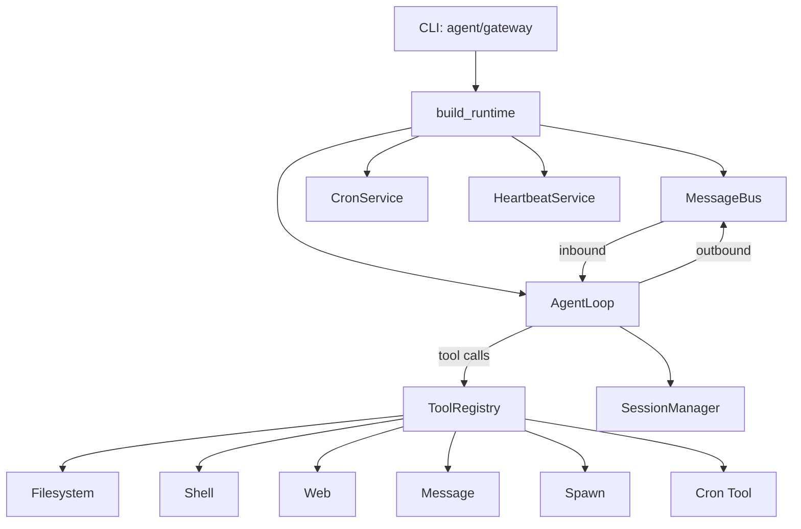
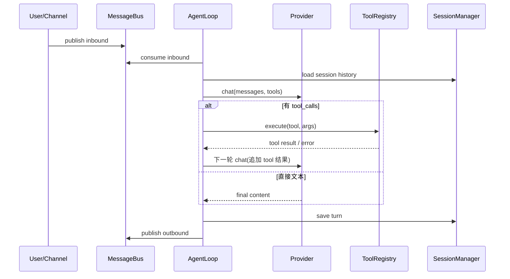

# nanobot-rs 源码级设计（MVP）

本文档描述当前 Rust 版本的实现状态与边界，并对齐 Python 版本的语义。

## 1. 目标与范围

- 目标：在 Rust 中复刻 nanobot 的核心链路（配置 -> AgentLoop -> Tools -> Session -> Cron/Heartbeat）。
- 范围：`nanobot-rs/src`。
- 非目标：本阶段不实现 Python 全量渠道适配器（Telegram/Discord/Slack 等）。

## 2. 组件映射（Rust vs Python）

| 领域 | Rust 模块 | Python 对应 | 状态 |
|---|---|---|---|
| 启动与命令 | `src/cli/mod.rs` | `nanobot/cli/commands.py` | 已实现基础命令 |
| 运行时组装 | `src/runtime/app.rs` | `nanobot/runtime/*` | 已实现 |
| 配置加载/迁移 | `src/config/*` | `nanobot/config/*` | 已实现（兼容 camel/snake） |
| Provider 抽象 | `src/provider/*` | `nanobot/providers/*` | 已实现 OpenAI-compatible 主路径 |
| 消息总线 | `src/bus/*` | `nanobot/bus/*` | 已实现 |
| Agent 主循环 | `src/agent/loop_core.rs` | `nanobot/agent/loop.py` | 已实现核心流程 |
| 工具系统 | `src/tools/*` | `nanobot/agent/tools/*` | 已实现内置工具 |
| 会话存储 | `src/session/manager.rs` | `nanobot/session/manager.py` | 已实现 jsonl 持久化 |
| Cron | `src/cron/service.rs` + `src/tools/cron.rs` | `nanobot/cron/*` | 已实现 |
| Heartbeat | `src/heartbeat/service.rs` | `nanobot/heartbeat/*` | 已实现 |
| 渠道适配器 | 暂无独立 adapters 模块 | `nanobot/channels/*.py` | 未完整实现（见 channel 路线图） |

## 3. 总体运行流

## 4. Agent 回合语义

参考代码：`src/agent/loop_core.rs`

关键行为：

- `/help`、`/new`、`/stop` 内建命令在 Agent 层处理。
- 工具错误统一包装成可继续推理的提示文本（避免回合硬中断）。
- 若当轮已通过 `message` 工具发送到当前目标，可抑制默认自动回复。

## 5. 工具系统设计

参考对齐：

- Python 注释：`nanobot/agent/tools/base.py`、`nanobot/agent/tools/registry.py`
- 设计文档：`docs/components/07-tools.md`

Rust 现状：

- 工具定义使用强类型 schema：`src/tools/base.rs`。
- 工具入口：`src/tools/registry.rs`。
- 内置工具：filesystem / shell / web / message / spawn / cron。
- 参数解析：`parse_args<T>`，统一通过 serde 反序列化。
- 错误通道：`Result<String>`，避免字符串表达错误状态。

能力边界：

- 提供单次工具调用语义，不提供多工具事务一致性。
- 不保证工具幂等。
- 不提供跨回合工具状态同步（除工具自身 context）。

## 6. 会话与记忆

参考代码：`src/session/manager.rs`、`src/agent/memory.rs`

- 会话文件：`workspace/sessions/*.jsonl`。
- 首行 metadata，后续为消息行，便于增量读取与容错。
- `last_consolidated` 用于消息归档边界。
- MEMORY/HISTORY 与模板系统配合由上下文构建器注入。

## 7. 定时与心跳

- Cron：`src/cron/service.rs`，支持 `every/cron/at` 三类调度。
- Cron Tool：`src/tools/cron.rs`，对 Agent 暴露 `add/list/remove`。
- Heartbeat：`src/heartbeat/service.rs`，周期读取 `HEARTBEAT.md` 并触发执行回调。

能力边界：

- 当前为单进程调度，不是分布式任务系统。
- 重启恢复依赖本地存储，不做跨实例一致性协调。

## 8. 配置兼容策略

参考：`src/config/schema.rs` + `src/config/loader.rs`

- 兼容 camelCase 与 snake_case 输入。
- 保留 Python 配置结构（agents/providers/tools/channels/gateway）以降低迁移成本。
- provider 自动匹配与默认 api_base 行为对齐 Python 设计。

## 9. 与 Python 版本的主要差异（当前）

1. 渠道适配器未完整移植。
2. MVP 以 CLI/Gateway 本地交互为主，外部平台发送链路仍需扩展。
3. 部分 provider 特性（例如 OAuth 细分路径）仍在后续补齐范围。

## 10. 后续演进建议

1. 将 ToolRegistry 升级为“显式动态注册表”（支持插件热注册/卸载、冲突检测、权限域）。
2. 在 `channels` 维度引入统一 `ChannelAdapter` trait，并与 `MessageBus` 做标准入/出站契约。
3. 补充跨组件契约测试：`channel -> bus -> agent -> outbound` 端到端链路。
