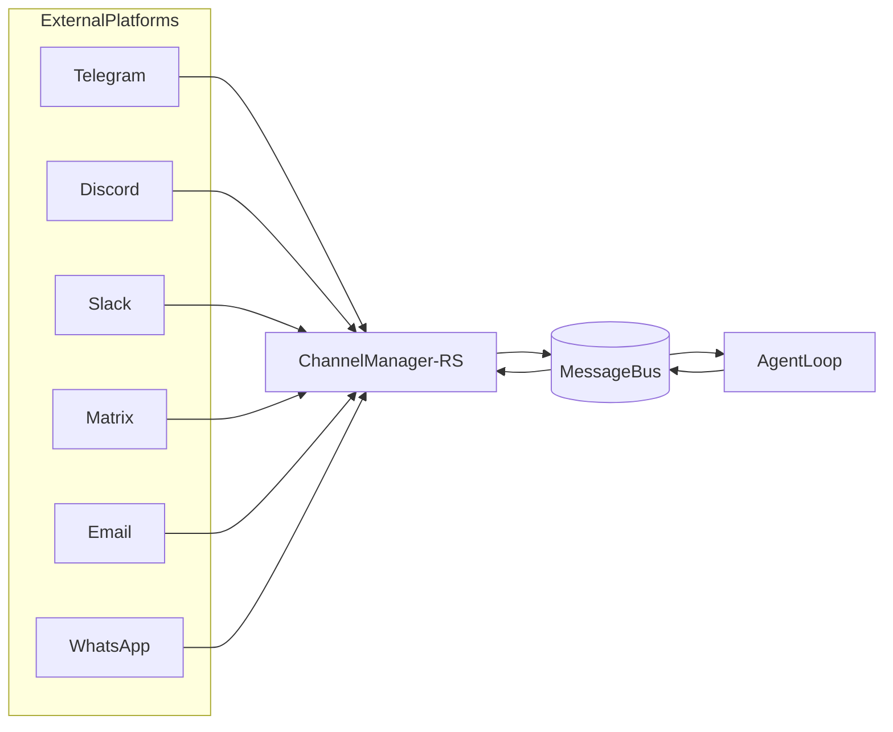

# nanobot-rs 渠道兼容路线图

本文件用于把 Rust 版本逐步补齐到 Python 的多渠道能力。

## 1. 对齐基线

Python 侧渠道管理实现与注释：

- `nanobot/channels/manager.py`
- `nanobot/channels/base.py`
- `nanobot/channels/*.py`

语言无关设计文档：

- `docs/components/12-channels.md`

## 2. Python 当前支持的渠道（基线）

按 `manager.py` 初始化逻辑：

- `telegram`
- `whatsapp`
- `discord`
- `feishu`
- `mochat`
- `dingtalk`
- `email`
- `slack`
- `qq`
- `matrix`

## 3. Rust 当前状态

- 已有：
  - `channels` 配置结构（`src/config/schema.rs`）
  - `MessageBus` 标准入站/出站事件模型（`src/bus/events.rs`, `src/bus/queue.rs`）
  - Agent 主循环可消费标准入站并产出标准出站
- 缺失：
  - 独立渠道适配器层（相当于 Python `nanobot/channels/*.py`）
  - 渠道生命周期管理器（相当于 Python `ChannelManager`）
  - 平台 ACL / 线程路由 / 媒体上下行适配

## 4. 建议的 Rust 渠道抽象

```rust
#[async_trait]
pub trait ChannelAdapter: Send + Sync {
    fn name(&self) -> &str;
    async fn start(&self) -> anyhow::Result<()>;
    async fn stop(&self) -> anyhow::Result<()>;
    async fn send(&self, msg: OutboundMessage) -> anyhow::Result<()>;
}
```



## 5. 分阶段落地计划（MVP -> 完整）

### Phase 1: 管理器骨架

- 新增 `src/channels/mod.rs`、`src/channels/manager.rs`。
- 实现统一 `start_all/stop_all/dispatch_outbound`。
- 先接 `cli` 作为内置 adapter（便于联调）。

### Phase 2: 单渠道打通（建议 Telegram）

- 完成 inbound 标准化：`platform update -> InboundMessage`。
- 完成 outbound 发送：`OutboundMessage -> platform api`。
- 完成基础 ACL（allowFrom）。

### Phase 3: 扩展到 Discord/Slack/Matrix

- 抽取公共能力：
  - 线程/会话键映射
  - 媒体下载与本地暂存
  - 平台错误重试策略

### Phase 4: WhatsApp bridge 对齐

- 参考 `docs/components/13-whatsapp-bridge.md` 对齐 Node bridge 协议。
- 把 bridge 输入输出映射到统一 bus 事件。

## 6. 能力边界建议

- 渠道层只做协议映射、ACL 和消息转发，不承担 LLM 推理与工具执行。
- 单渠道故障不影响其他渠道（管理器隔离异常）。
- 所有入站最终落到统一 `InboundMessage`，所有出站走统一 `OutboundMessage`。

## 7. 完成判定（DoD）

- 每个新增渠道至少有：
  - 1 个入站转换测试
  - 1 个出站发送测试
  - 1 个 ACL/策略测试
- 提供 `gateway` 运行态可观测日志：启动成功、消息收发、错误统计。
